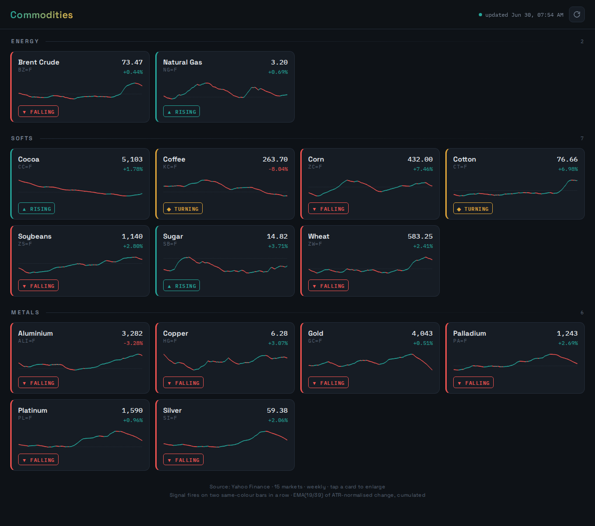

# Commodities — Trend Scanner

A self-updating dashboard that tracks your commodity universe on the **weekly**
timeframe and renders your **1939** trend indicator for each market. Installable
as an app on iPhone and desktop. Runs for **$0** on GitHub's free tier — no
server to maintain.



## How it works

```
GitHub Actions (hourly cron)
        │
        ├─ collector/collect.py
        │     ├─ pulls daily history + live quote from Yahoo Finance
        │     ├─ resamples to weekly bars (the in-progress week stays LIVE)
        │     ├─ computes the 1939 oscillator (faithful to your PineScript)
        │     └─ writes market_data.json
        │
        └─ deploys  web/ + market_data.json  to GitHub Pages
                    │
                    └─ the PWA fetches market_data.json and renders
```

The indicator's cumulative `summation` is anchored to a **fixed start date**
(2016-01-01), so the absolute MSI level is stable run-to-run instead of drifting.
Because it cumulates over all history, the level won't match TradingView to the
decimal unless identical bars are loaded — but direction, signal crossovers and
slope (what you trade) are identical.

## Deploy (about 5 minutes, one time)

1. Create a new GitHub repo and push this folder to it:
   ```bash
   git init && git add . && git commit -m "commodities dashboard"
   git branch -M main
   git remote add origin https://github.com/<you>/1939-dashboard.git
   git push -u origin main
   ```
2. In the repo: **Settings → Pages → Build and deployment → Source: GitHub Actions**.
3. **Actions** tab → run **Update Commodities dashboard** once (the ▶ "Run workflow"
   button) to publish immediately. After that it runs hourly on its own.
4. Your dashboard is live at `https://<you>.github.io/1939-dashboard/`.

### Put it on your iPhone
Open the URL in Safari → Share → **Add to Home Screen**. It launches full-screen
with the 1939 icon and refreshes itself while open.

## Run the collector locally
```bash
pip install -r requirements.txt
python collector/collect.py --out site/market_data.json
# then serve the site to preview:
cd site && python -m http.server 8000   # → http://localhost:8000
```

## Customise

- **Universe** — edit `UNIVERSE` at the top of `collector/collect.py`.
- **Indicator params** — `FAST, SLOW, ATR_LEN, SCALE, SIG_LEN` (currently 19/39/14/100/9).
- **Refresh cadence** — the `cron` line in `.github/workflows/update.yml`
  (GitHub's scheduler can lag under load; for tighter timing, a Cloudflare
  Worker cron is an alternative).
- **History depth** — `ANCHOR` (start date) and `KEEP_WEEKS` (chart length).

## Excluded: LME nickel / lead / zinc

These three trade only on the LME, whose price data is licensed commercially and
not freely redistributed — no free source carries them. They're intentionally
left out to keep this $0 and fully automated. (Aluminium is included as the CME
contract, a close proxy for LME aluminium.) If you ever want the LME three, the
route is an IBKR sidecar feeding them in, but that needs an always-on machine
running IB Gateway plus the LME market-data subscription.

## Files
```
collector/collect.py          data fetch + 1939 indicator
web/index.html                the dashboard (PWA, no build step)
web/sw.js                     service worker (offline / instant load)
web/manifest.webmanifest      installability
web/icon-*.png                app icons
.github/workflows/update.yml  hourly build + deploy
```
